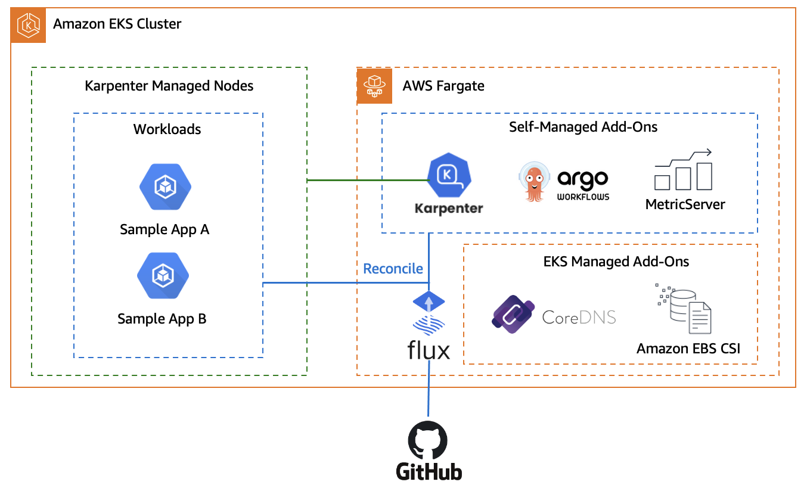

# EKS Cluster Upgrades ImmersionDay Module


:bangbang: THIS WORKSHOP IS PERFORMING UPGRADES FROM VERSION `1.24` :bangbang:

This workshop covers best practices that are applicable for both older and newer versions of Kubernetes. We are committed to keeping our content up-to-date with the latest Amazon EKS releases, Let's get started!


## Introduction

The Amazon cluster upgrades workshop is built to provide you with a reference architecture that can help make your Amazon EKS Cluster upgrades less painful and more seamless. To achieve this, we will be using a GitOps strategy with Fluxv2 for components reconciliation and Karpenter for Node Scaling.

### Why this architecture?

One of the key benefits of using GitOps is that it enables us to use a mono repository approach for deploying both add-ons and applications. This approach makes the upgrade process much smoother because we have a single location to look at for deprecated API versions and ensure that add-ons are backwards compatible.



By the end of this workshop, you will have a solid understanding of how to use GitOps with Fluxv2 and Karpenter to simplify the EKS Cluster upgrade process. We hope that this will help you to streamline your workflow and ensure that your infrastructure is always up-to-date and functioning smoothly. So, let's dive in and get started!


## Navigating the repository

The top level repository can be split is to several areas.

### Site content

The workshop content itself is a `docusaurus` site. All workshop content is written using Markdown and can be found in `website`.

### Learner environment

To spin -up your learn environment, go to [`website`](./website/README.md#local-development) page and follow the instructions to run your docussaurus website.

### Locally deploy with terraform:

**You will need to fork this repo.**
###Connect to GitHub
```bash 
export GITHUB_TOKEN=<your-token>
export GITHUB_USER=<your-username>
export GIT_BRANCH=main
echo "export GITHUB_TOKEN=${GITHUB_TOKEN}" | tee -a ~/.bash_profile
echo "export GITHUB_USER=${GITHUB_USER}" | tee -a ~/.bash_profile
echo "export GIT_BRANCH=${GIT_BRANCH}" | tee -a ~/.bash_profile
zz

```
Once forked, execute the `install.sh` (located in the root of this repo) script and fill te asked questions:

```bash
bash ./install.sh 
```

> When asked for `tf_state_path` leave it empty to provision all the components

After that you will need to uncomment lines `5` and `6` of `gitops/add-ons/kustomization.yaml` file

Then you can push the changes to your desired branch and flux will reconcile the changes

###Why GitOps?
One of the main customer challenges regarding EKS Cluster Upgrades is to make sure that your applications and add-ons don’t break compatibility with the newer EKS version. To help with this goal, we are going to use a GitOps strategy. GitOps works based on a SCM repository, where it becomes the only source of truth, and our GitOps controller, in this case FluxV2 will just mirror what we have declared into the repository

cluster upgrades?
As mentioned earlier, one of the major challenges that people face during cluster upgrades is compatibility. We need to validate our application’s manifests, making sure that we are not using anything removed from the API Server. So, using a mono repo strategy can help us on doing those validations easier. We can use tools such as kube-no-trouble and pluto to seek for those deprecated/removed apiVersions into a single place along with kubectl convertplugin that can help us to change those apiVersions in an automated way. Also, this repo structure helps us to identify our self-managed add-ons versions since all the add-ons that we are using are in a single place.

#Flux Reconciliation
Flux reconciliation is the process by which Flux continuously monitors a Git repository for changes to Kubernetes manifests and automatically applies them to a connected cluster. When a change is detected in the repository, Flux compares the updated manifest with the current state of the cluster. If there's a discrepancy, Flux updates the cluster to match the desired state defined in the Git repository. This GitOps-based approach ensures consistency, version control, and automation in managing Kubernetes deployments, streamlining CI/CD pipelines, and reducing human erro

In the previous module we have executed the install.sh script, it has installed flux into your cluster and also has cloned the forked repository. The script also has made some changes into some of our manifests. Let's apply it and see how flux reconciles those changes.

```bash
cd /home/ec2-user/environment/eks-cluster-upgrades-workshop && git status
```

As you can, see there are some unstaged files that we need to commit and push to our repo, those files are two add-ons that we are gonna be using during this workshop, karpenter and argo-workflows. Now let's uncomment lines 5 and 6 of add-ons kustomization.yaml (Kustomization object) file. 
```bash
sed -i 's/# //' /home/ec2-user/environment/eks-cluster-upgrades-workshop/gitops/add-ons/kustomization.yaml
cat /home/ec2-user/environment/eks-cluster-upgrades-workshop/gitops/add-ons/kustomization.yaml
```
Your Kustomization manifest should look like this: 
```yaml
apiVersion: kustomize.config.k8s.io/v1beta1
kind: Kustomization
resources:
  - 01-metric-server.yaml
  - 02-karpenter.yaml
  - 03-argo-workflows.yaml
  ```
  
  Once you push those changes to the GitHub repository, flux will automatically apply and deploy both karpenter and argo-workflows using a Helm Chart. Let's push those changes:
  ```bash 
  
  cd /home/ec2-user/environment/eks-cluster-upgrades-workshop/
git add .
git commit -m "Added add-ons in kutomization file"
git push origin $GIT_BRANCH
```
Flux will now detect the changes and start the reconciliation process. It does this by periodically polling the GitHub repository for changes. You can monitor the Flux logs to observe the reconciliation process:

```bash 
kubectl -n flux-system get pod -o name | grep -i source | while read POD; do kubectl -n flux-system logs -f $POD --since=1m; done

```
Veryfing if karpenter and argo-workflows were installed successfully:
``bash 
 kubectl get helmreleases -nflux-system
 ```
 You should see the following output:
 ```bash 
 NAME             AGE    READY   STATUS
argo-workflows   119s   True    Release reconciliation succeeded
karpenter        119s   True    Release reconciliation succeeded
metrics-server   32m    True    Release reconciliation succeeded
```
#Karpenter during the upgrade process

Karpenter is a Kubernetes node scaling that has the goal of automatically launches just the right compute resources to handle your cluster’s applications. Many people position Karpenter just to save money, making Spot instance usage easier, but Karpenter can also help a customer reduce their operational overhead. Karpenter, by default, will use Amazon EKS optimized AMIs. Whenever Karpenter launches a new node, it will match the Control Plane version of that node. It means that after an upgrade process you don’t need to upgrade all your Nodes at once, you can let Karpenter little by little replace nodes with old kubelet version, to new ones that matches EKS Control Plane version. 
```ymal 
apiVersion: karpenter.sh/v1alpha5
kind: Provisioner
metadata:
  name: default
spec:
  providerRef:
    name: default
  taints:
    - key: applications
      effect: NoSchedule
  labels:
    node-type: applications
  # Provisioner file continues
  ```
This will make sure that only applications that we define both NodeSelector and a Toleration to karpenter taint will be scheduled into Karpenter nodes. Let's verify our sample-app manifest:
```bash

cat /home/ec2-user/environment/eks-cluster-upgrades-workshop/gitops/applications/01-sample-app.yaml | grep nodeSelector -A5
```
The output should look like this:
```bash
nodeSelector: # Force scale on Karpenter nodes
  node-type: applications
tolerations: # Force scale on Karpenter nodes
  - key: "applications"
    operator: "Exists"
    effect: "NoSchedule"
```
    
    
    Verify Node provisioning
Karpenter will provision Nodes based on Pods in Pending state, since we already had our sample-app Pods in that state let's check if Karpenter already provisioned a Node to handle that workload, first let's validate that our sample-app Pods are up and running:
```bash
kubectl -n default get pod
```
The output should look like this:
```bash
NAME                     READY   STATUS    RESTARTS   AGE
nginx-6b855ddcb7-457ls   1/1     Running   0          58m
nginx-6b855ddcb7-bbck2   1/1     Running   0          58m
nginx-6b855ddcb7-kphps   1/1     Running   0          58m
```
Now let's verify the new Node by passing node-type=applications label:

kubectl get nodes -l node-type=applications

Your output should me similar to this:
```bash
NAME                             STATUS   ROLES    AGE   VERSION
ip-192-168-60-113.ec2.internal   Ready    <none>   21m   v1.24.xx-eks-a59e1f0
```
TIP
In the above command you will see that Karpenter by default will match the kubelet Node version with the EKS Control Plane version.

To make sure that those Pods are running in this new Node created by Karpenter, let's execute the following command:

kubectl -n default get pods -o wide --field-selector spec.nodeName=$(kubectl get nodes -l node-type=applications | awk '/ip/ {print $1}')


The output should look like this:
```bash
NAME                    READY   STATUS    RESTARTS   AGE   IP             NODE                                        NOMINATED NODE   READINESS GATES
nginx-c5bfd7b85-9snbt   1/1     Running   0          48m   10.35.33.113   ip-10-35-46-50.us-east-2.compute.internal   <none>           <none>
nginx-c5bfd7b85-g67lb   1/1     Running   0          48m   10.35.33.115   ip-10-35-46-50.us-east-2.compute.internal   <none>           <none>
nginx-c5bfd7b85-swmvj   1/1     Running   0          48m   10.35.33.112   ip-10-35-46-50.us-east-2.compute.internal   <none>           <none>
```

In this module, we used Karpenter for Node scaling, making sure that just what we apply both toleration and NodeSelector will be scheduled in Karpenter Nodes.

#Validating State
  Checking for deprecated APIs and updating your manifests to use the latest API versions before upgrading your Kubernetes cluster is crucial for preventing compatibility issues, avoiding downtime, maintaining a secure and stable environment, easing maintenance, staying informed about Kubernetes changes, and ensuring compliance with best practices. Using tools like Pluto, kube no trouble and kubectl convert streamlines the process of identifying and updating deprecated APIs, making it easier to maintain a healthy Kubernetes environment.
  
  
  Argo workflows validate pipeline
For this workshop, we have automated all the validation steps in an argo-workflows pipeline, so let's run our workflow to verify what are the things that we need to change.

```bash 

cd /home/ec2-user/environment/eks-cluster-upgrades-workshop/upgrades-workflows && kubectl apply -f upgrade-validate-workflow.yaml
```
Getting Argo workflows UI 


:
```bash 
echo $(kubectl get svc -nargo-workflows | awk '{print $4}' | grep -vi external):2746/workflows?limit=50
  ```
  

Now click in the workflow and you are gonna be able to see all the validation steps that this workflow is executing

##Checking workflow report


Open the report, it should look like the following:
```bash 
========================== AWS BASICS VALIDATION ==========================
Subnet Check: At least one subnet has more than 5 IPs available
Role Check: Cluster role exists
Security Group Check: Cluster security group exists 
 ====================== Kubent Deprecated APIs report ======================
__________________________________________________________________________________________
>>> Deprecated APIs removed in 1.25 <<<
------------------------------------------------------------------------------------------
KIND                NAMESPACE     NAME             API_VERSION      REPLACE_WITH (SINCE)
CronJob             default       hello            batch/v1beta1    batch/v1 (1.21.0)
PodSecurityPolicy   <undefined>   eks.privileged   policy/v1beta1   <removed> (1.21.0)
__________________________________________________________________________________________
>>> Deprecated APIs removed in 1.26 <<<
------------------------------------------------------------------------------------------
KIND                      NAMESPACE   NAME        API_VERSION           REPLACE_WITH (SINCE)
HorizontalPodAutoscaler   default     nginx-hpa   autoscaling/v2beta1   autoscaling/v2 (1.23.0) 
 ====================== Self Managed Add-ons ======================
NAME             AGE   READY   STATUS
argo-workflows   38m   True    Release reconciliation succeeded
karpenter        38m   True    Release reconciliation succeeded
metrics-server   68m   True    Release reconciliation succeeded
====================== Deprecated API in helm charts  ======================
There were no resources found with known deprecated apiVersions. 
=========================== EKS Managed add-ons ===========================
Need to upgrade aws-ebs-csi-driver from v1.19.0-eksbuild.1 to v1.19.0-eksbuild.2
Need to upgrade kube-proxy from v1.24.10-eksbuild.2 to v1.25.9-eksbuild.1 
====================== Must look URLs ======================
K8s Rel notes: https://relnotes.k8s.io/?kinds=api-change&kinds=deprecation&releaseVersions=1.25.0
EKS Notes: https://docs.aws.amazon.com/eks/latest/userguide/kubernetes-versions.html#kubernetes-1.25
```
As you can see, the only thing that we need to change is what kube-no-trouble have identified under Deprecated APIs removed in 1.25 and Deprecated APIs removed in 1.26. We don't have any self-managed add-on using a deprecated API, and for the managed add-ons aws is managing them, so we will upgrade them when we upgrade our Control Plane using Terraform.

Using kubectl convert to change the manifests
The Kubent Deprecated APIs report have identified two manifests using depreacated API versions:
```bash 
KIND                NAMESPACE     NAME             API_VERSION      REPLACE_WITH (SINCE)
CronJob             default       hello            batch/v1beta1    batch/v1 (1.21.0)

KIND                      NAMESPACE   NAME        API_VERSION           REPLACE_WITH (SINCE)
HorizontalPodAutoscaler   default     nginx-hpa   autoscaling/v2beta1   autoscaling/v2 (1.23.0)
```
Let's update those using kubectl convert, those manifests are being reconciled by Flux, let's start by changing the CronJob:

kubectl convert -f /home/ec2-user/environment/eks-cluster-upgrades-workshop/gitops/applications/deprecated-manifests/02-deprecated-cronjob.yaml > /home/ec2-user/environment/eks-cluster-upgrades-workshop/gitops/applications/deprecated-manifests/02-deprecated-cronjob.bak && mv /home/ec2-user/environment/eks-cluster-upgrades-workshop/gitops/applications/deprecated-manifests/02-deprecated-cronjob.bak /home/ec2-user/environment/eks-cluster-upgrades-workshop/gitops/applications/deprecated-manifests/02-deprecated-cronjob.yaml


Let's do the same thing for the HorizontalPodAutoscaler manifest:
```bash
kubectl convert -f /home/ec2-user/environment/eks-cluster-upgrades-workshop/gitops/applications/deprecated-manifests/03-deprecated-hpa.yaml > /home/ec2-user/environment/eks-cluster-upgrades-workshop/gitops/applications/deprecated-manifests/03-deprecated-hpa.bak && mv /home/ec2-user/environment/eks-cluster-upgrades-workshop/gitops/applications/deprecated-manifests/03-deprecated-hpa.bak /home/ec2-user/environment/eks-cluster-upgrades-workshop/gitops/applications/deprecated-manifests/03-deprecated-hpa.yaml
```

Let's uncomment kutomization.yaml file to flux watch those manifests:
```bash
sed -i 's/# //' /home/ec2-user/environment/eks-cluster-upgrades-workshop/gitops/applications/kustomization.yaml
```

Now let's commit the changes to your GitHub repository, so flux can apply those changes.
```bash
cd /home/ec2-user/environment/eks-cluster-upgrades-workshop/
git add .
git commit -m "Changed deprecated APIs"
git push origin $GIT_BRANCH
```
Flux will now detect the changes and start the reconciliation process. It does this by periodically polling the GitHub repository for changes. You can monitor the Flux logs to observe the reconciliation process:
```bash
kubectl -n flux-system get pod -o name | grep -i source | while read POD; do kubectl -n flux-system logs -f $POD --since=1m; done
```

You should see logs indicating that the new changes have been detected and applied to the cluster:
```bash
{"level":"info","ts":"2023-06-05T19:56:11.469Z","msg":"stored artifact for commit 'Changed deprecated APIs'","controller":"gitrepository","controllerGroup":"source.toolkit.fluxcd.io","controllerKind":"GitRepository","GitRepository":{"name":"flux-system","namespace":"flux-system"},"namespace":"flux-system","name":"flux-system","reconcileID":"d1808938-8d2c-43f7-8bc0-0d1419778546"}
```

Run argo workflows validate pipeline again


Argo will create a new workflow. Now let's wait until this new workflow has finished and then download the latest report as you have done earlier. Open the report, it should look like below:
```bash 
========================== AWS BASICS VALIDATION ==========================
Subnet Check: At least one subnet has more than 5 IPs available
Role Check: Cluster role exists
Security Group Check: Cluster security group exists 
 ====================== Kubent Deprecated APIs report ======================
__________________________________________________________________________________________
>>> Deprecated APIs removed in 1.25 <<<
------------------------------------------------------------------------------------------
KIND                NAMESPACE     NAME             API_VERSION      REPLACE_WITH (SINCE)
PodSecurityPolicy   <undefined>   eks.privileged   policy/v1beta1   <removed> (1.21.0) 
 ====================== Self Managed Add-ons ======================
NAME             AGE     READY   STATUS
argo-workflows   178m    True    Release reconciliation succeeded
karpenter        178m    True    Release reconciliation succeeded
metrics-server   3h29m   True    Release reconciliation succeeded
====================== Deprecated API in helm charts  ======================
There were no resources found with known deprecated apiVersions. 
 =========================== EKS Managed add-ons ===========================
Need to upgrade aws-ebs-csi-driver from v1.19.0-eksbuild.1 to v1.19.0-eksbuild.2
Need to upgrade kube-proxy from v1.24.10-eksbuild.2 to v1.25.9-eksbuild.1 
 ====================== Must look URLs ======================
K8s Rel notes: https://relnotes.k8s.io/?kinds=api-change&kinds=deprecation&releaseVersions=1.25.0
EKS Notes: https://docs.aws.amazon.com/eks/latest/userguide/kubernetes-versions.html#kubernetes-1.25
```
###Upgrading EKS
In this guide, we'll go through the process of upgrading your Amazon Elastic Kubernetes Service (EKS) cluster, which is essential for maintaining optimal performance, security, and availability.

We also will cover the importance of updates, how AWS manages EKS upgrades, and what happens when an upgrade fails. Finally, we will provide instructions on how to update the eksctl.yaml file in the helpers folder and apply the changes using the eksctl command.

How AWS Manages EKS Upgrades
The EKS upgrade process is managed by AWS to ensure a seamless and safe transition between Kubernetes versions. Here is a detailed breakdown of the steps AWS takes to upgrade the EKS control plane:


Pre-upgrade checks: AWS first performs pre-upgrade checks, including assessing the current cluster state and evaluating the compatibility of the new version with your workloads. If any issues are detected, the upgrade process will not proceed.

Backup and snapshot: Before initiating the upgrade, AWS takes a backup of your existing control plane and creates a snapshot of your etcd data store. This is done to ensure data consistency and to enable rollback in case of an upgrade failure.

TIP
For additional data protection, consider using Velero, an open-source tool that simplifies the backup and recovery process for Kubernetes cluster resources and persistent volumes. Velero allows you to schedule and manage backups, as well as restore processes, providing an extra layer of safety for your data.

Creating a new control plane: AWS creates a new control plane with the desired Kubernetes version. This new control plane runs in parallel with your existing control plane, ensuring minimal disruption to your workloads.

Testing compatibility: The new control plane is tested for compatibility with your workloads, including running automated tests to verify that your applications continue to function as expected.

TIP
The goal is to minimize potential disruptions during the upgrade process and maintain the stability of your services. It's important to mention that this only looks for your application health and not for API's that may be removed or deprecated

Switching control plane endpoints: Once compatibility is confirmed, AWS switches the control plane endpoints (API server) to the new control plane. This switch happens atomically, resulting in minimal downtime during the upgrade process.

Terminating the old control plane: The old control plane is terminated once the upgrade is complete, and all resources associated with it are cleaned up.

#EKS Rollback on Upgrade Failure


In case an EKS upgrade fails, AWS has measures in place to minimize disruption and revert the control plane to its previous version:

Detecting the failure: AWS constantly monitors the upgrade process to detect any issues. If a problem arises during the upgrade, the process is immediately halted.

Restoring from backup: AWS uses the backup and snapshot created before the upgrade to restore the control plane and etcd data store to their previous state.

Switching control plane endpoints: AWS atomically switches the control plane endpoints back to the previous control plane, ensuring minimal downtime.

Terminating the new control plane: Once the rollback is complete, AWS terminates the new control plane and cleans up any associated resources.

Post-rollback assessment: After the rollback, AWS will assess the reasons behind the upgrade failure and provide guidance on how to address the issues. You will need to troubleshoot and resolve the problems before attempting the upgrade again.

#Upgrading EKS Cluster
We have used terraform to spin-up our cluster, all the add-ons are managed via Flux and we already have done the validation of deprecated APIs and add-ons, let's apply the cluster upgrade to a newer version:
```bash 
cd /home/ec2-user/environment/eks-cluster-upgrades-workshop/terraform/clusters

terraform plan -var="git_password=$GITHUB_TOKEN" -var="git_username=$GITHUB_USER" -var="git_url=https://github.com/$GITHUB_USER/eks-cluster-upgrades-workshop.git" -var="git_branch=$GIT_BRANCH" -var="aws_region=$AWS_REGION" -var="cluster_version=1.25"
```
As you can see we are defining the variable cluster_version=1.25 forcing terraform to change the Control Plane to version 1.25. Also since we are using EKS managed add-ons we can upgrade tham all together to the latest available version, see snippet below of the output of terraform plan:
```bash 
  # module.eks.time_sleep.this[0] must be replaced
    +/- resource "time_sleep" "this" {
      ~ id              = "2023-06-05T15:14:32Z" -> (known after apply)
      ~ triggers        = { # forces replacement
          ~ "cluster_version"                    = "1.24" -> "1.25"
            # (3 unchanged elements hidden)
        }
        # (1 unchanged attribute hidden)
    }

    ~ resource "aws_eks_addon" "before_compute" {
      ~ addon_version        = "v1.12.6-eksbuild.2" -> (known after apply)
        id                   = "eks-upgrades-workshop:vpc-cni"
        tags                 = {
            "Blueprint"              = "eks-upgrades-workshop"
            "GithubRepo"             = "github.com/aws-ia/terraform-aws-eks-blueprints"
            "karpenter.sh/discovery" = "eks-upgrades-workshop"
        }
        # (8 unchanged attributes hidden)

        # (1 unchanged block hidden)
    }

    # module.eks.aws_eks_addon.this["aws-ebs-csi-driver"] will be updated in-place
  ~ resource "aws_eks_addon" "this" {
      ~ addon_version     = "v1.19.0-eksbuild.1" -> (known after apply)
        id                = "eks-upgrades-workshop:aws-ebs-csi-driver"
        tags              = {
            "Blueprint"              = "eks-upgrades-workshop"
            "GithubRepo"             = "github.com/aws-ia/terraform-aws-eks-blueprints"
            "karpenter.sh/discovery" = "eks-upgrades-workshop"
        }
        # (7 unchanged attributes hidden)

        # (1 unchanged block hidden)
    }

    # module.eks.aws_eks_addon.this["coredns"] will be updated in-place
  ~ resource "aws_eks_addon" "this" {
      ~ addon_version        = "v1.9.3-eksbuild.3" -> (known after apply)
        id                   = "eks-upgrades-workshop:coredns"
        tags                 = {
            "Blueprint"              = "eks-upgrades-workshop"
            "GithubRepo"             = "github.com/aws-ia/terraform-aws-eks-blueprints"
            "karpenter.sh/discovery" = "eks-upgrades-workshop"
        }
        # (8 unchanged attributes hidden)

        # (1 unchanged block hidden)
    }

  # module.eks.aws_eks_addon.this["kube-proxy"] will be updated in-place
  ~ resource "aws_eks_addon" "this" {
      ~ addon_version     = "v1.24.10-eksbuild.2" -> (known after apply)
        id                = "eks-upgrades-workshop:kube-proxy"
        tags              = {
            "Blueprint"              = "eks-upgrades-workshop"
            "GithubRepo"             = "github.com/aws-ia/terraform-aws-eks-blueprints"
            "karpenter.sh/discovery" = "eks-upgrades-workshop"
        }
        # (7 unchanged attributes hidden)

        # (1 unchanged block hidden)
    }
   ```
   
   As you can see, using terraform we are forcing all the managed-add-ons also to be upgraded to the latest available version, now let's apply the script.
   ```bash 
   
terraform apply --auto-approve -var="git_password=$GITHUB_TOKEN" -var="git_username=$GITHUB_USER" -var="git_url=https://github.com/$GITHUB_USER/eks-cluster-upgrades-workshop.git" -var="git_branch=$GIT_BRANCH" -var="aws_region=$AWS_REGION" -var="cluster_version=1.25"
```
After it finished, let's validate that our cluster is really in the desired version by running the follow command:
```bash
kubectl version | grep -i server
```
The output should be similar to this:
```
Server Version: version.Info{Major:"1", Minor:"25+", GitVersion:"v1.25.9-eks-0a21954", GitCommit:"eb82cd845d007ae98d215744675dcf7ff024a5a3", GitTreeState:"clean", BuildDate:"2023-04-15T00:37:59Z", GoVersion:"go1.19.8", Compiler:"gc", Platform:"linux/amd64"}
```
#Upgrading Nodes

n this workshop both self-managed and managed add-ons are hosted in Fargate micro-vms, it means that we don't need to worry about the upgrade of the things that are hosted using Fargate since it is a serverless way to run applications. But our sample-app is running in Nodes provisioned by Karpenter, so let's explore what challenges can be involved when upgrading Nodes, and how Karpenter will help us.

Karpenter by default will use Amazon EKS optimized AMIs, whenever Karpenter launches a new node, it will match the Control Plane version of that node. It means that after an upgrade process you don't need to upgrade all your Nodes at once, you can let Karpenter little by little replace nodes with old kubelet version, to new ones that matches EKS Control Plane version.

Rollout Karpenter nodes
Getting the Node name that we will perform the drain:

```bash
kubectl get nodes -l node-type=applications
```
Validate if all of our application pods are running in the same Node:
```
kubectl -n default get pods -o=custom-columns=NAME:.metadata.name,STATUS:.status.phase,NODE:.spec.nodeName
```
Output should look like this:
```
NAME                     STATUS    NODE
nginx-c5bfd7b85-9snbt   Running     ip-10-35-46-50.us-east-2.compute.internal
nginx-c5bfd7b85-g67lb   Running     ip-10-35-46-50.us-east-2.compute.internal
nginx-c5bfd7b85-swmvj   Running     ip-10-35-46-50.us-east-2.compute.internal
```

As you can see, all the 3 nginx replicas are running in the same node, let's start by using kubectl cordon to mark your old nodes as unschedulable:
```bash
kubectl cordon $(kubectl get nodes -l node-type=applications -oname)

kubectl get nodes -l node-type=applications
```
You should see an output similar to this:
```
NAME                          STATUS                     ROLES    AGE   VERSION
ip-192-168-6-9.ec2.internal   Ready,SchedulingDisabled   <none>   21h   v1.24.xx-eks-a59e1f0
```

STATUS will be SchedulingDisabled, because kubectl cordon command have applied a taint into this node to make sure new pods are not schedule in it.

Let's drain our Node, using kubectl drain to safely evict all of your pods from your old nodes to the new ones.
```
kubectl drain $(kubectl get nodes -l node-type=applications -oname) --ignore-daemonsets
```

The output should be similar to this.
```
node/ip-10-35-46-50.us-east-2.compute.internal already cordoned
Warning: ignoring DaemonSet-managed Pods: kube-system/aws-node-629pr, kube-system/ebs-csi-node-rfgzv, kube-system/kube-proxy-q2b56
evicting pod default/nginx-c5bfd7b85-swmvj
evicting pod default/nginx-c5bfd7b85-9snbt
evicting pod default/hello-28100160-4gwbq
evicting pod default/nginx-c5bfd7b85-g67lb
error when evicting pods/"nginx-c5bfd7b85-g67lb" -n "default" (will retry after 5s): Cannot evict pod as it would violate the pod's disruption budget.
error when evicting pods/"nginx-c5bfd7b85-swmvj" -n "default" (will retry after 5s): Cannot evict pod as it would violate the pod's disruption budget.
error when evicting pods/"nginx-c5bfd7b85-9snbt" -n "default" (will retry after 5s): Cannot evict pod as it would violate the pod's disruption budget.
pod/hello-28100160-4gwbq evicted

```
Ops! it seems that we have a too agressive Pod Disruption Budget let's fix that.

Adjusting PDBs (Pod Diruption Budgets)
Let's see how our PDB is configured now:
```
kubectl get pdb
```
As you can see we have the MIN AVAILABLE of 3, and we have only 3 replicas of our sample-app running, so this PDB is considered TOO AGRESSIVE, let's change that:
```
cat <<'EOF' > /home/ec2-user/environment/eks-cluster-upgrades-workshop/gitops/applications/01-pdb-sample-app.yaml
apiVersion: policy/v1
kind: PodDisruptionBudget
metadata:
  name: nginx-pdb
  namespace: default
spec:
  minAvailable: 1
  selector:
    matchLabels:
      app: nginx
EOF
```

We have changed the minAvailable from 3 to 1, this will give us space to drain. Commit and push the changes to the repository:
```
cd /home/ec2-user/environment/eks-cluster-upgrades-workshop/
git add .
git commit -m "Changed PDB manifest from 3 to 1"
git push origin $GIT_BRANCH
```
Wait few seconds, and validate that Flux has applied the new PDB:
```
kubectl -n default get pdb/nginx-pdb -w
```
You should see the output similar to this:
```
NAME        MIN AVAILABLE   MAX UNAVAILABLE   ALLOWED DISRUPTIONS   AGE
nginx-pdb   1               N/A               2                     36m
```
As we can see we have changed the MIN AVAILABLE to 1 so now we can have 2 ALLOWED DISRUPTIONS.

NOTE
This can change depending on each use case, remember to always configure PDBs based on your needs.

Rollout Karpenter nodes (Adjusted PDB)
Now, try to drain your node again:
```
kubectl drain $(kubectl get nodes -l node-type=applications -oname) --ignore-daemonsets

```
Since we are defining at least 1 replica available, Karpenter will deploy a new Node for us before terminating the old one to guarantee HA. After it finished let's see the new node that we have.
```
kubectl get nodes -l node-type=applications
```
You should see the following output:
```
NAME                                         STATUS   ROLES    AGE   VERSION
ip-10-35-10-230.us-east-2.compute.internal   Ready    <none>   69s   v1.25.xx-eks-0a21954
```

As you can see, we have two nodes managed by Karpenter, one that is being drained with version 1.24 and a new one with version 1.25, Karpenter notice those pods that were evicted before and create a new node to handle those pods, let's verify again:
```
kubectl get nodes -l node-type=applications
kubectl -n default get pods -o=custom-columns=NAME:.metadata.name,STATUS:.status.phase,NODE:.spec.nodeName
```

You should now be able to see only a single Node managed by Karpenter, and all pods running in this new Node.

As you can see, the Server Version is now 1.25
   

# Cleanup
Congratulations on completing the EKS Upgrades Workshop! To avoid incurring unnecessary costs and to keep your AWS environment, it is important to clean up the resources created during the workshop.
```bash
terraform state rm 'module.flux_v2'

terraform destroy -var="git_password=$GITHUB_TOKEN" -var="git_username=$GITHUB_USER" -var="git_url=https://github.com/$GITHUB_USER/eks-cluster-upgrades-workshop.git" -var="git_branch=$GIT_BRANCH" -var="aws_region=$AWS_REGION" -var="cluster_version=1.25" --auto-approve
```

# Upgrade-EKS
